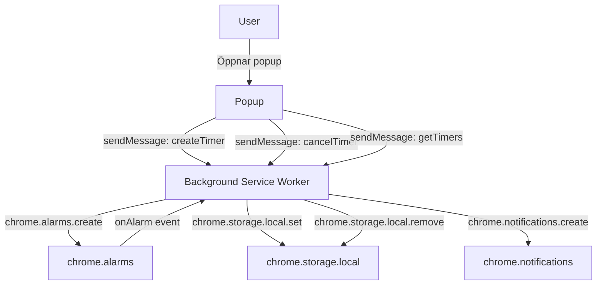

# Design – Tab Timers

## Overview

Tab Timers lägger till nedräkningstimers i det befintliga Time Tracker-tillägget. Funktionen är helt självständig inom tillägget och kräver inga backend-ändringar. Timers skapas via popup:en, hanteras av background service workern med `chrome.alarms`, lagras persistent i `chrome.storage.local` och levererar notifikationer via `chrome.notifications`.

Nyckelprinciper:
- En timer per domän (identifieras av befintlig `getDomain()`-logik)
- Timers överlever service worker-omstarter tack vare `chrome.storage.local` + `chrome.alarms`
- Popup kommunicerar med background via `chrome.runtime.sendMessage`
- Ingen ny backend-kod behövs

## Architecture



Meddelandeflöde (popup → background):

| Action | Payload | Svar |
|---|---|---|
| `createTimer` | `{ domain, durationSeconds }` | `{ ok, error? }` |
| `cancelTimer` | `{ domain }` | `{ ok }` |
| `getTimers` | – | `{ timers: Timer[] }` |

## Components and Interfaces

### background.js – tillägg

Ny logik läggs till i den befintliga service workern.

**`createTimer(domain, durationSeconds)`**
- Validerar att `durationSeconds` är ett positivt heltal ≤ 86400
- Ersätter eventuell befintlig timer för domänen (clear alarm + remove storage)
- Sparar `TimerRecord` i `chrome.storage.local`
- Skapar alarm: `chrome.alarms.create(alarmName(domain), { when: Date.now() + durationSeconds * 1000 })`

**`cancelTimer(domain)`**
- Kör `chrome.alarms.clear(alarmName(domain))`
- Tar bort `TimerRecord` från storage

**`alarmName(domain)`**
- Returnerar `"tab-timer::" + domain` – unikt prefix för att inte krocka med eventuella framtida alarm

**`chrome.alarms.onAlarm` listener**
- Filtrerar på prefix `"tab-timer::"`
- Hämtar `TimerRecord` från storage
- Visar notifikation
- Tar bort timern från storage

**`chrome.runtime.onMessage` – nya actions**
- `createTimer` → anropar `createTimer()`, svarar `{ ok: true }` eller `{ ok: false, error }`
- `cancelTimer` → anropar `cancelTimer()`, svarar `{ ok: true }`
- `getTimers` → läser storage, svarar `{ timers: TimerRecord[] }`

**Uppstartslogik (service worker init)**
- Läser alla `TimerRecord` från storage
- För varje post: kontrollerar om alarm finns via `chrome.alarms.get`
- Om alarm saknas och sluttid är i framtiden: återskapar alarm
- Om sluttid redan passerat: visar notifikation direkt och tar bort posten

### popup.html – tillägg

Nytt sektionselement `#timers-section` infogas under befintlig statistiklista:

```html
<section id="timers-section">
  <h2>Timers</h2>
  <div id="timer-form">
    <input type="number" id="timer-minutes" min="1" max="1440" placeholder="Minuter">
    <button id="timer-start">Starta timer</button>
    <div id="timer-error" class="error hidden"></div>
  </div>
  <ul id="timer-list"></ul>
  <p id="no-timers" class="hidden">Inga aktiva timers.</p>
</section>
```

### popup.js – tillägg

**`loadTimers()`**
- Skickar `getTimers` till background
- Renderar listan; för varje timer visas domän, återstående tid och en avbryt-knapp
- Startar `setInterval` (1 s) som räknar ned visad tid lokalt

**`startTimer()`**
- Läser och validerar `#timer-minutes` (positivt heltal, 1–1440)
- Skickar `createTimer` till background
- Anropar `loadTimers()` på svar

**`cancelTimer(domain)`**
- Skickar `cancelTimer` till background
- Anropar `loadTimers()` på svar

**Formulärvisning**
- Om en aktiv timer redan finns för aktiv domän: dölj `#timer-form`, visa timern i listan
- Annars: visa `#timer-form`

## Data Models

### TimerRecord (lagras i `chrome.storage.local`)

```js
// Nyckel: "tab-timer::" + domain
{
  domain: string,       // t.ex. "github.com"
  startTime: number,    // Date.now() vid skapandet (ms)
  durationMs: number,   // varaktighet i millisekunder
  endTime: number       // startTime + durationMs (ms) – beräknad sluttid
}
```

Lagring sker som ett objekt per timer med nyckeln `"tab-timer::" + domain`. Det gör det enkelt att hämta, uppdatera och ta bort enskilda timers utan att läsa hela storage.

### Validering

- `durationSeconds` måste vara ett heltal, > 0 och ≤ 86400 (1440 min)
- `domain` måste vara ett icke-tomt stränge som inte börjar med `chrome://` eller `chrome-extension://`

## Correctness Properties

*A property is a characteristic or behavior that should hold true across all valid executions of a system – essentially, a formal statement about what the system should do. Properties serve as the bridge between human-readable specifications and machine-verifiable correctness guarantees.*

### Property 1: Ogiltig varaktighet avvisas alltid

*For any* inmatning som inte är ett positivt heltal eller som överstiger 1440 (t.ex. 0, negativa tal, decimaltal, strängar, värden > 1440), ska valideringsfunktionen returnera ett fel och ingen timer ska skapas i storage eller som alarm.

**Validates: Requirements 1.3, 1.4**

---

### Property 2: createTimer sparar korrekt TimerRecord

*For any* giltig domän och giltig varaktighet i sekunder, ska ett anrop till `createTimer` resultera i att ett `TimerRecord` med rätt `domain`, `durationMs` och `endTime` (≈ `Date.now() + durationSeconds * 1000`) finns i `chrome.storage.local` under nyckeln `"tab-timer::" + domain`.

**Validates: Requirements 1.5**

---

### Property 3: Alarm schemaläggs med korrekt tid

*For any* giltig domän och varaktighet, ska `chrome.alarms.create` anropas med alarmnamnet `"tab-timer::" + domain` och ett `when`-värde som är lika med `endTime` i det sparade `TimerRecord`. Detta gäller både vid nytt skapande (krav 1.6) och vid återuppbyggnad efter omstart (krav 6.3).

**Validates: Requirements 1.6, 6.3**

---

### Property 4: Tidformateringsfunktionen är korrekt

*For any* icke-negativt heltal av sekunder, ska formateringsfunktionen returnera en sträng som matchar mönstret `Xm Ys`, `Xm` eller `Ys` (beroende på storlek) och som korrekt representerar den angivna tiden.

**Validates: Requirements 2.2**

---

### Property 5: Alarm-hanteraren visar notifikation med rätt innehåll och tar bort timern

*For any* domän med en aktiv timer, när motsvarande alarm utlöses, ska `chrome.notifications.create` anropas med ett objekt som innehåller domännamnet i titel eller body, och `TimerRecord` ska därefter inte längre finnas i `chrome.storage.local`.

**Validates: Requirements 3.1, 3.2, 3.3, 3.4**

---

### Property 6: cancelTimer rensar alarm och storage

*For any* domän med en aktiv timer, ska ett anrop till `cancelTimer` resultera i att `chrome.alarms.clear` anropas med `"tab-timer::" + domain` och att `TimerRecord` inte längre finns i `chrome.storage.local`.

**Validates: Requirements 4.3, 4.4**

---

### Property 7: En domän kan bara ha en aktiv timer

*For any* domän, om `createTimer` anropas två gånger med olika varaktigheter, ska storage och alarm-registret bara innehålla en post för den domänen och den ska motsvara det senaste anropet.

**Validates: Requirements 5.2**

---

### Property 8: Uppstart återskapar alarm för timers vars sluttid är i framtiden

*For any* `TimerRecord` i storage vars `endTime` är i framtiden och vars alarm saknas, ska uppstartslogiken anropa `chrome.alarms.create` med korrekt `when`-värde.

**Validates: Requirements 6.2, 6.3**

---

## Error Handling

| Scenario | Hantering |
|---|---|
| Ogiltigt värde i popup (ej heltal, ≤ 0, > 1440) | Visa felmeddelande i `#timer-error`, skapa inte timer |
| `createTimer` anropas för domän utan aktiv flik | Background svarar `{ ok: false, error: "no_active_tab" }` |
| `chrome.alarms.create` misslyckas | Logga fel, ta bort eventuellt sparat TimerRecord |
| `chrome.storage.local` otillgänglig | Logga fel, visa generellt felmeddelande i popup |
| Alarm utlöses men TimerRecord saknas i storage | Ignorera tyst (alarm kan ha rensats manuellt) |
| Service worker startar om med passerad sluttid | Visa notifikation direkt, ta bort posten |
| `chrome.notifications` saknar behörighet | Logga fel, fortsätt (timer rensas ändå) |

## Testing Strategy

### Dual Testing Approach

Funktionen testas med både enhetstester (specifika exempel och edge cases) och property-baserade tester (universella egenskaper över slumpmässiga indata).

### Enhetstester (specifika exempel)

- Popup renderar formulär vid öppning (krav 1.1)
- Popup visar lista med aktiva timers (krav 2.1)
- Popup visar "inga timers"-meddelande när listan är tom (krav 2.4)
- Avbryt-knapp visas för aktiv timer (krav 4.1)
- Popup döljer formulär om aktiv timer finns för domänen (krav 5.1)
- Popup uppdaterar listan efter avbryt (krav 4.5)
- Uppstartslogik läser storage och kontrollerar alarm (krav 6.2)
- manifest.json innehåller `"alarms"`, `"notifications"` och inga nya host_permissions (krav 7.1–7.3)
- Passerad sluttid vid uppstart → notifikation + borttagning (krav 6.4)

### Property-baserade tester

Bibliotek: **fast-check** (JavaScript/Node.js). Minst 100 iterationer per test.

Varje test taggas med:
`// Feature: tab-timers, Property N: <property_text>`

| Test | Property | Generators |
|---|---|---|
| Ogiltig varaktighet avvisas | Property 1 | `fc.oneof(fc.constant(0), fc.integer({max: -1}), fc.float(), fc.string())` + heltal > 1440 |
| createTimer sparar korrekt post | Property 2 | `fc.string()` (domän), `fc.integer({min:1, max:86400})` (sekunder) |
| Alarm schemaläggs med rätt tid | Property 3 | Samma som Property 2 |
| Tidformatering är korrekt | Property 4 | `fc.integer({min:0, max:86400})` |
| Alarm-hanteraren notifierar och rensar | Property 5 | `fc.string()` (domän) |
| cancelTimer rensar alarm och storage | Property 6 | `fc.string()` (domän) |
| En timer per domän | Property 7 | `fc.string()` (domän), två `fc.integer` (varaktigheter) |
| Uppstart återskapar alarm | Property 8 | `fc.string()` (domän), `fc.integer({min:1})` (sekunder kvar) |

### Testmiljö

- Jest + jsdom för popup-tester
- Jest med mockade Chrome-API:er (`chrome.alarms`, `chrome.storage`, `chrome.notifications`, `chrome.runtime`) för background-tester
- `jest-chrome` eller manuella mock-objekt för Chrome Extension API:er
