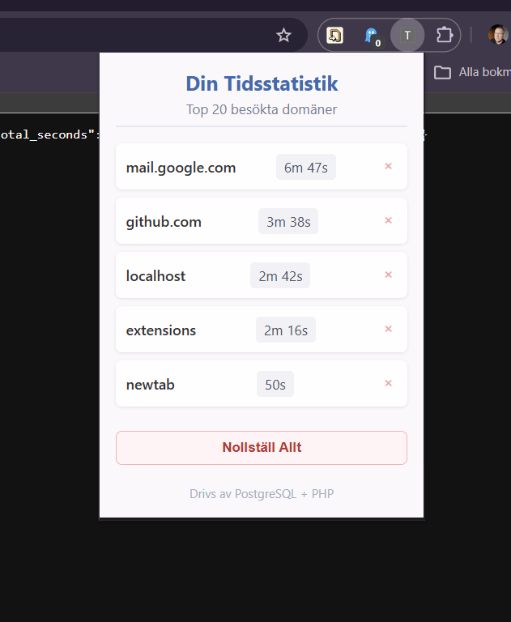

# Time Tracker Chrome Extension

Ett Chrome-tillägg som automatiskt loggar hur mycket tid du spenderar på olika webbplatser. Den visualiserar sedan en live-uppdaterad lista av dina mest besökta domäner via tilläggets popup-meny. Projektet använder en egenutvecklad PHP-backend och sparar datan i en PostgreSQL-databas.

## 🚀 Tech Stack

*   **Frontend (Chrome-tillägget)**
    *   **JavaScript (Manifest V3)**: Körs i bakgrunden (Service Worker) för att lyssna på flik-byten. Hanterar också logiken i popup-gränssnittet.
    *   **chrome.alarms**: Schemalägger timers som överlever omstarter av tillägget.
    *   **chrome.notifications**: Visar en systemnotifikation när en timer löper ut.
    *   **HTML & CSS**: För att måla upp tilläggets användargränssnitt.
    *   **Jest + fast-check**: Automatiserade tester inklusive property-based testing.
*   **Backend (API)**
    *   **PHP (v8.x)**: Binder ihop databasen med Chromes förfrågningar och returnerar formaterad JSON-data (`track.php` och `stats.php`).
*   **Databas**
    *   **PostgreSQL**: Sparar historiken över alla besökta domäner med hjälp av PHP Data Objects (PDO).

---

## 🛠 Installation

### 1. Förbered databasen (PostgreSQL)
1. Öppna PostgreSQL och säkerställ att du är uppkopplad (via t.ex psql eller pgAdmin).
2. Skapa databasen och tillhörande tabell genom att köra filen `schema.sql`:
   ```sql
   CREATE DATABASE time_tracker;
   -- Anslut sedan till time_tracker och kör koden i schema.sql
   ```
3. Fyll i dina databasuppgifter i filen `backend/config.php`.

### 2. Starta Backend (PHP server)
För att PHP-filerna ska fungera behöver du en server. Vi använder PHP:s inbyggda development server.

1. Öppna en terminal och navigera till backend-mappen:
   ```bash
   cd /sökväg/till/projekt/backend
   ```
2. Starta servern (anpassa kommandot om du t.ex. använder XAMPP:s php.exe):
   ```bash
   php -S localhost:8000
   ```
*Tips: Får du felmeddelandet "could not find driver", säkerställ att du har aktiverat `extension=pdo_pgsql` i din `php.ini`.*

### 3. Installera Chrome-tillägget
1. Öppna Google Chrome och gå till `chrome://extensions/`.
2. Aktivera **Utvecklarläge** (Developer mode) högst uppe till höger.
3. Klicka på **Läs in opackat tillägg** (Load unpacked).
4. Välj mappen `/sökväg/till/projekt/extension`.

### 4. Användning

Allt är klart!
När du nu surfar runt så skickar Google Chrome data till din server i bakgrunden varje gång du byter aktiv flik. 

Klicka på tilläggs-ikonen ("pusselbiten") och därefter på "**Time Tracker - PHP Backend**" uppe i verktygsfältet för att i realtid se vilka sidor du ödslar mest tid på!



#### Tab Timers

Du kan sätta en nedräkningstimer för den domän du för tillfället besöker:

* **Starta en timer:** Ange antal minuter (1–1440) i fältet längst ner i popup:en och klicka **Starta timer**. Timern kopplas till den aktiva flikens domän.
* **Notifikation:** När timern löper ut visas en Chrome-notifikation som talar om vilken domän det gäller.
* **Se aktiva timers:** Alla pågående timers listas i popup:en med domännamn och återstående tid, uppdaterad i realtid.
* **Avbryt en timer:** Klicka på **Avbryt** bredvid en timer i listan för att stoppa den i förtid.
* **En timer per domän:** Det kan bara finnas en aktiv timer per domän. Sätter du en ny timer för samma domän ersätts den gamla.
* **Överlever omstart:** Timers sparas i `chrome.storage.local` och återställs automatiskt om tillägget eller webbläsaren startas om.

### 5. Kör tester

Projektet har automatiserade tester med Jest och fast-check (property-based testing).

```bash
npx jest --forceExit
```

---

### 6. Hantera Data (Radera & Nollställ)

Du har full kontroll över din insamlade data:

* **Radera enskilda sidor:** Klicka på det röda krysset (`×`) bredvid en domän i listan för att radera all tid för just den webbplatsen.
* **Nollställ allt:** Längst ner i popup-fönstret hittar du knappen "Nollställ Allt" som raderar all din statistik permanent från både skärmen och webbdatabasen.

---

## 📁 Projektstruktur

```
├── extension/
│   ├── manifest.json       # Chrome extension manifest (v3)
│   ├── background.js       # Service worker – spårar aktiv flik och skickar data
│   ├── popup.html          # Popup-gränssnitt
│   ├── popup.js            # Hämtar och renderar statistik + timer-UI
│   ├── popup.css           # Styling för popup
│   ├── icon*.png           # Tilläggsikoner (16, 32, 48, 128px)
│   └── tests/
│       ├── background.test.js
│       └── popup.test.js
├── backend/
│   ├── config.php          # Databasuppgifter
│   ├── track.php           # Tar emot och sparar tid
│   ├── stats.php           # Returnerar statistik (top 20)
│   └── delete.php          # Raderar data
├── schema.sql              # PostgreSQL-schema för databasen
├── package.json            # Jest + fast-check beroenden
└── README.md
```
